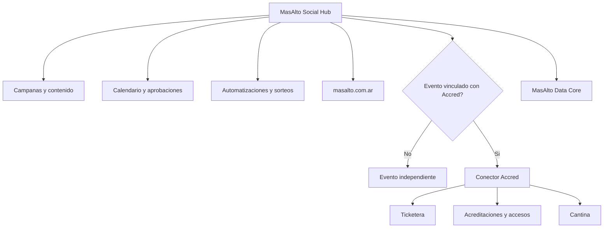

# Arquitectura

## Vista general



## Componentes recomendados

| Componente | Recomendacion |
|---|---|
| Aplicacion | Next.js PWA |
| Base de datos | Supabase/PostgreSQL |
| Autenticacion | Supabase Auth |
| Archivos | Supabase Storage o Google Drive |
| Automatizacion | n8n |
| Publicacion inicial | Metricool API o flujo asistido |
| Conversaciones | ManyChat + Meta |
| IA | OpenAI |
| Hosting | Vercel |
| Web publica | masalto.com.ar |

## MasAlto Data Core

Capa comun de datos para identidad, eventos, campanas y trazabilidad.

Esquemas sugeridos:

- `core`
- `campaigns`
- `events`
- `accred_bridge`
- `communications`
- `analytics`
- `audit`

## Entidades principales

```text
people
organizations
events
campaigns
content_assets
publishing_tasks
touchpoints
leads
audiences
giveaways
consents
integration_connections
sync_jobs
activity_log
```

## Campos clave de evento

```text
id
name
slug
starts_at
venue_name
city
ecosystem_mode: independent | accred
publish_to_website: boolean
website_status: hidden | draft | scheduled | published | private_link | archived
ticketing_provider: accred | external | physical | none
external_ticket_url
accred_event_id
sync_status: none | configured | syncing | linked | error | archived
```

## Modulos Accred por evento

```text
accred_modules
  ticketing: boolean
  accreditation: boolean
  access_control: boolean
  canteen: boolean
  invitations: boolean
  sales_reporting: boolean
  post_event_loyalty: boolean
```

## Integracion con masalto.com.ar

Social Hub debe exponer o sincronizar datos publicos de eventos.

Opciones tecnicas:

1. API privada desde Social Hub hacia `masalto.com.ar`.
2. Webhooks para invalidar cache cuando cambia un evento.

La opcion preferida es API versionada mas webhooks de cache. La web publica no accede
directamente a tablas o vistas internas de Supabase.

## Integracion con Accred

Social Hub no debe escribir tablas internas de Accred. Debe usar un conector:

```text
Social Hub -> Accred Connector -> API de Accred
```

Responsabilidades del conector:

- Crear o vincular eventos.
- Consultar precios, sectores y stock.
- Recibir ventas y ordenes.
- Recibir acreditaciones.
- Recibir check-ins.
- Recibir consumos de cantina agregados.
- Mantener cola de sincronizacion.
- Registrar errores sin bloquear campanas.

## Estados de resiliencia

Si falla Accred:

- Se mantienen publicaciones y campanas.
- Se capturan leads.
- Se registran intentos de sincronizacion.
- Se muestra alerta al operador.
- Se reintenta cuando vuelva la conexion.

Si falla el proveedor de publicacion o una red social:

- Se marca publicacion como fallida.
- Se conserva pieza y copy.
- Se permite reintento o publicacion manual.

El proveedor no esta seleccionado. Postiz, Metricool y APIs directas son candidatos
detras de una interfaz reemplazable.

## Seguridad

Requisitos minimos:

- Roles por organizacion y proyecto.
- Permisos por evento.
- Registro de auditoria.
- No guardar tokens en texto plano.
- Variables de entorno para secretos.
- Confirmacion humana para acciones externas importantes.
- Separacion de datos personales, operativos y comerciales.
- Consentimiento explicito para comunicaciones comerciales.

## Ambientes

- Local.
- Preview.
- Produccion.

No conectar produccion de Accred sin preflight y contrato aprobado.
